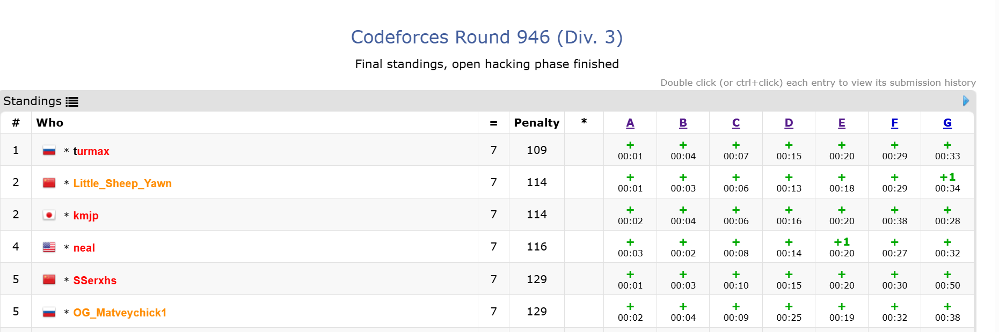

# 排名系统

参考 Codeforces 的 Standings 页面



## 模型

Base class: `ContestRank`

实际上是用户和比赛之间多对多关系的中间表

- `User`, `Contest`

两种赛制分别继承该基类:

- `ACMContestRank`
- `OIContestRank`

## 注册接口

用户参加比赛需要对比赛进行注册 register

实际效果就是为用户和比赛之间创建关联, 生成一个新的 `ContestRank` 实例

## 排名接口

`ContestRankAPI`

作为比赛模块下的接口

`GET contest/:contest_id/rankings`

返回单场比赛下的全部排名信息

返回结果

同时考虑分页(query 参数带一个 page)

- 分页用 Paginator 实现

例如 `GET contest/237612/rankings?page=1`

- 获取比赛 id=237612 的排名信息, 同时分页显示第 1 页

## 示例返回

```json
{
    "error": null,
    "data": {
        "contest_id": 237612,
        "contest_name": "第二届奇点杯校赛",
        "contest_type": "ACM",
        "scoreboard": [
            {
                // 顺序: 按 ac 数+罚时排序
                "user" : {
                    "username": "user1",
                    "avatar": "https://cdn.swufe.edu/avatar/user1.png",
                },
                "accepted_problems": 2,
                "accepted_number": 2,
                "total_time": 540,
                "submission_info": [
                    {"T1": {"is_accepted" : true, "accepted_time": 120, "error_number": 2, "is_first_ac": true}},
                    {"T2": {"is_accepted" : false, "accepted_time": 0, "error_number": 12, "is_first_ac": false}},
                    {"T3": {"is_accepted" : true, "accepted_time": 420, "error_number": 4, "is_first_ac": false}}
                ]
            },
            {
                "user" : {
                    // ....
                }
                // ...
            }
        ]
    }
}
```
