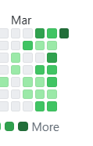
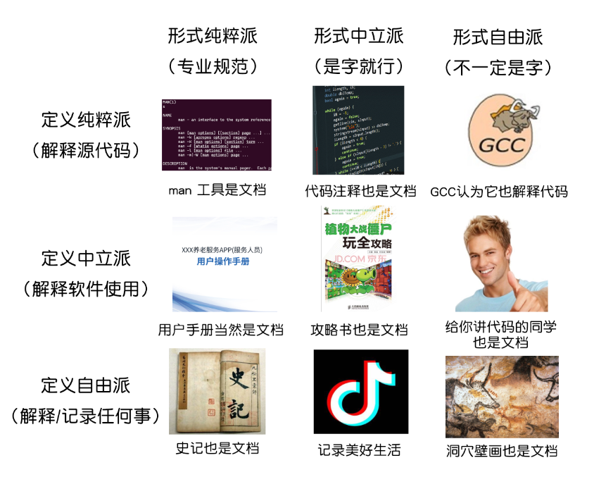
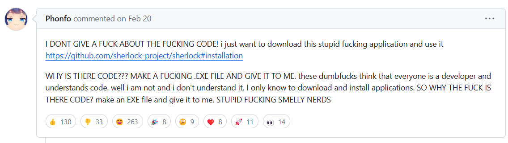

# 这两周的工作汇报

### 为啥上周没开会

- 后端部长都在爆肝比赛项目
- 是时候给你们看看我的 Github commit 记录了
  - 大家也要有这种写项目的热情😂

- 而且很多同学有事来不了
- **反思**: 是强度有些高了么...

<!-- vslide -->

# 这两周的工作汇报

### 幻灯片模板

给开会用的 slides 写了一个模板 [revealjs-academic-theme](https://github.com/Besthope-Official/revealjs-academic-theme)

有没有发现今天的 PPT 格外认真

- 基于 reveal.js, 制作的学术风格的模板
- 仿的是 NJU OS 课, 以及 Latex Beamer 的风格
- 现在写 markdown 就能快速生成 PPT 简直不要太爽 🤤
- 欢迎大家试用
  - 也可以比方说给点 star 鼓励一下 (
- 欢迎大家的建设性建议, 一起来完善这个模板

<!-- vslide -->

# 这两周的工作汇报

### SWUFE-OJ

TBD

<!-- slide -->

# Review: Git 及基础操作

上上周讲的 Git, 你还记得多少...?

### 拷打时间

- **常回家看看**: 记得查阅[自家文档](https://singularity-backend.gitbook.io/backend-online-doc/) or [Pro Git](https://singularity-backend.gitbook.io/backend-online-doc/) 去了解相关概念
  - 文件 unstaged 为啥不让我提交啊😵...?
  - Git 为什么能检测到每次修改的变动?
- 了解分布式开发团队协作的流程:
  - 分支管理
  - 冲突解决
  - 提交前你忘记对本地代码更新了, 导致 git 拒绝了你的推送, 你要怎么做?
    - plan A: 强制推送 `git push -f`
    - plan B?
  - 什么是 `git revert`?

<!-- slide -->

# 说些闲话

### 画饼时间

当你走出去实习或者打比赛, 你就会感受到这种差距:

- 我可是科班开发出身的! 就是比你们厉害. 口亨😊

确保*了解*这些概念, 它们便会伴随大家开发的生涯**一直**走下去...

- 只要你还从事计算机开发相关的工作

这也是开发部对大家的一个小小要求. 你会发现我们一直在强调这些看起来和代码不沾边的东西: **老师课上可不会讲**...

- MIT 还专门出过一门课 [missing semester](https://missing-semester-cn.github.io/), 就花了大笔的时间讲一些 CLI 工具的使用.

<!-- slide -->

# 到底什么是技术文档

Wikipedia: *Software documentation is written text or illustration that accompanies computer software or is embedded in the source code.* 🤓👆

<!-- vslide -->

# 到底什么是技术文档

### 以刚结束的花旗杯比赛为例:

你得提交三个技术文档(严格来说是六个)

- **需求文档**: 你做这个是干什么的
- **用户文档**: 用户怎么用
- **测试文档**: 都测试了什么功能

当然, 花旗要交的技术文档, 考验的其实是你的语言组织和扯废话能力...

<!-- vslide -->

# 到底什么是技术文档

看看优秀开源项目的文档

- [Django](https://docs.djangoproject.com/zh-hans/5.0/)
- [全栈 FastAPI 项目模板](https://github.com/tiangolo/full-stack-fastapi-template)
- 接口文档

<!-- slide -->

# so... why tech doc?

<!-- slide -->

# 参考文档

- [技术文档写作指南](https://write-the-document.readthedocs.io/)